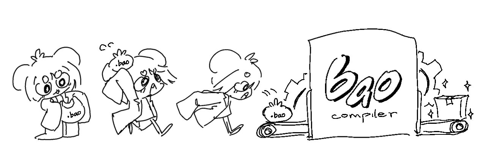

<div align="center">
  <picture>
    
  </picture>

  Bao - Ngôn ngữ lập trình Tiếng Việt
</div>

# Ngôn ngữ lập trình Bao
    

Xin chào đến với dự án trình biên dịch Bao!

Repo này chứa mã nguồn của trình biên dịch. Mục đích cuối cùng của dự án này là có thể "Bao" bọc được các thư viện chương trình C và C++ vào một ngôn ngữ lập trình dễ hơn. Ngôn ngữ mang tính chất giáo dục là chính.

# Tại sao Tiếng Việt?
- Bởi không có ngôn ngữ lập trình nào (ít nhất thì tôi không biết) mà sử dụng Tiếng Việt cả. Và dự án này sẽ giúp hiểu biết được thêm cách xử lý các ký tự Unicode trong một trình biên dịch và từ khoá nhiều từ.

- Nói chung là ngôn ngữ này có mục đích nghiên cứu và học tập chứ không phải để dùng thường ngày.

# Build


Hướng dẫn build cho máy của mình
### macOS và Linux
Đầu tiên là cài LLVM (backend của trình biên dịch)
- Đối với macOS bạn hãy cài [Homebrew](https://brew.sh)
rồi chạy câu lệnh này
```console
brew install llvm
```
- Đối với Linux thì chạy câu lệnh này
```console
bash -c "$(wget -O - https://apt.llvm.org/llvm.sh)"
```
Còn lại thì cả hai đều chạy câu lệnh sau trong terminal
```console
./unix-setup.sh
cmake --build build
```
### Windows
> [!NOTE] 
> Chưa chính thức test hoặc hỗ trợ, nếu bạn quen việc tự build làm ơn đóng góp dự án với script cài đặt PowerShell boặc Batch file

Bạn cài LLVM bằng Chocolatey hoặc winget. Mình chưa thử nên không có hướng dẫn ở đây.

Các dependency còn lại thì chạy như sau:
- Clone repo của [vcpkg](https://github.com/microsoft/vcpkg.git) vào thư mục dự án
- Chạy script `bootstrap-vcpkg.bat`
- Chạy lệnh sau:
```console
vcpkg/vcpkg install
cmake -B build -S . -DCMAKE_TOOLCHAIN_FILE="vcpkg/scripts/buildsystems/vcpkg.cmake"
cmake --build build
```

# Đóng Góp
 

Làm ơn đóng góp vào dự án nếu bạn tìm thấy bug , điểm yếu, hoặc để lại bình luận.

# License


Dự án Bao được xuất bản với giấy phép Apache-2.0.

Đọc thêm tại đây [LICENSE-APACHE](LICENSE)